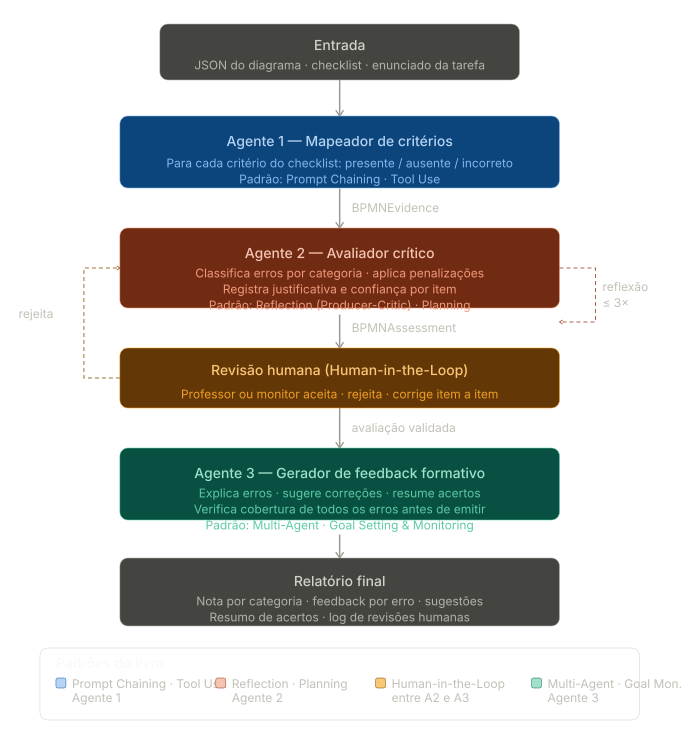

# TLAP1 - Definição e escopo do projeto

Definição e planejamento do projeto da disciplina Tópicos Avançados e Linguagens de Programação 1.

Equipe: 

| Antônio Neto   | apnn@cin.ufpe.br  |
| -------------- | ----------------- |
| Diego José     | djaar@cin.ufpe.br |
| Jailson Júnior | jssj@cin.ufpe.br  |

Pasta drive: https://drive.google.com/drive/folders/1I2DH6sjTGRFeXnKwOiX1q-2BFgEGuDFi?usp=drive_link

# Avaliação Híbrida de Modelos BPMN com Agentes de IA

## Contextualização

A disciplina de Gestão de Processos de Negócio (GPN) do CIn-UFPE atende em média 60 alunos por semestre. Entre 2022.2 e 2024.2, **178 alunos** geraram aproximadamente **223 avaliações manuais** de diagramas BPMN — cada uma exigindo leitura detalhada, feedback individualizado e atribuição de nota por categoria (sintaxe, semântica, boas práticas, atendimento à proposta).

Esse volume impõe dois problemas documentados empiricamente no TCC de base:

1. **Variabilidade inter-avaliadores** — diferenças de experiência entre professores e monitores produzem inconsistências na identificação de erros e nas penalizações.
2. **Inflação do checklist** — o instrumento avaliativo cresce sem hierarquização, diluindo o peso relativo dos erros mais críticos.

Este projeto implementa um **protótipo MVC** do núcleo técnico da proposta de mestrado: um pipeline de três agentes que recebe a descrição estruturada de um diagrama BPMN, aplica o checklist da disciplina e produz avaliação + feedback formativo, com uma etapa de revisão humana entre as etapas de avaliação e geração de feedback.

## Os Três Agentes e Seus Papéis

## Os Três Agentes em Detalhe

### Agente 1: Mapeador de Critérios

**Entrada:** JSON simplificado do diagrama BPMN, lista de elementos (tipo, nome, conexões), e o checklist da disciplina em texto estruturado.

**O que faz:** para cada critério do checklist, verifica se o elemento correspondente está presente, ausente ou incorreto no diagrama. Não emite julgamento, apenas mapeia evidências.

**Por que JSON e não XML:** o XML nativo do BPMN 2.0 varia entre ferramentas (BPMN.IO, Camunda, Bizagi) e é excessivamente verboso. Um JSON simplificado, preenchido manualmente ou exportado por script auxiliar, garante entrada previsível sem desviar o projeto para parsing de formato. Para o mestrado, o parser XML real será implementado depois, o Agente 1 está projetado para aceitar qualquer representação estruturada de entrada.

**Padrões:** Prompt Chaining (leitura → mapeamento → estruturação), Tool Use (leitura de arquivo JSON).

**Saída:** `BPMNEvidence` — lista de `{criterio_id, categoria, status, elemento, observacao}`.

### Agente 2: Avaliador Crítico

**Entrada:** `BPMNEvidence` do Agente 1.

**O que faz:** classifica cada evidência de erro, aplica a penalização do checklist, justifica a decisão e registra um score de confiança (0–1) por item. Itera sobre o próprio output para verificar consistência antes de emitir.

**Padrões:**

- *Planning*: antes de avaliar, gera um plano por categoria (sintaxe → semântica → boas práticas → proposta).
- *Reflection (Producer-Critic)*: após a avaliação inicial, revisa item a item: "a penalização está justificada pela evidência?" Itens com confiança < 0,6 são marcados como `revisar`.

**Saída:** `BPMNAssessment` — lista de `{criterio_id, categoria, penalizacao, justificativa, confianca, flag_revisar}` + nota parcial por categoria.

### Opcional: revisão Humana (Human-in-the-Loop simplificado)

O Agente 2 gera um arquivo `assessment_review.json`. O avaliador humano abre o arquivo, edita os campos que discorda (penalização, justificativa) e salva. O pipeline lê o arquivo editado e passa ao Agente 3.

É simples e manual, mas preserva o conceito central da pesquisa de mestrado: a intervenção humana acontece entre a avaliação automatizada e a geração do feedback, e pode ser rastreada pela diferença entre o `BPMNAssessment` original e o arquivo editado.

### Agente 3: Gerador de Feedback Formativo

**Entrada:** `BPMNAssessment` validado pelo humano + enunciado + diagrama.

**O que faz:** produz feedback formativo personalizado — não apenas lista os erros, mas explica por que cada um é um problema pedagógico e como corrigi-lo. Monitora se todos os erros identificados foram cobertos no feedback antes de emitir.

**Padrões:**

- *Multi-Agent Collaboration* — integra os artefatos dos dois agentes anteriores.
- *Goal Setting & Monitoring* — verifica cobertura (todo erro em `BPMNAssessment` tem feedback correspondente?) e clareza (linguagem acessível ao nível do estudante?).

**Saída:** relatório com (1) nota final por categoria e total, (2) feedback por erro com sugestão de correção, (3) resumo dos acertos.

## Ferramentas Similares Existentes

| Ferramenta                   | Foco                               | Pontos fortes                                        | Pontos fracos                                                |
| ---------------------------- | ---------------------------------- | ---------------------------------------------------- | ------------------------------------------------------------ |
| **ProMoAI**                  | Geração de BPMN a partir de texto  | Suporta GPT-4 e Claude 3.5 Sonnet; exporta BPMN/PNML | Foco em *geração*, não em *avaliação*; resultados não-determinísticos com mesma entrada |
| **BPMN-Chatbot**             | Geração conversacional             | 94% menos tokens que ProMoAI; 95% de corretude       | Sem avaliação pedagógica; sem feedback formativo             |
| **Camunda BPMN Copilot**     | Assistência à modelagem            | Integrado ao ecossistema Camunda                     | Proprietário; sem critérios pedagógicos                      |
| **Bizagi**                   | Modelagem e validação              | Validação sintática automática; ferramenta líder     | Apenas sintaxe/estrutura; sem LLM; sem feedback              |
| **Ullrich & Striewe (2023)** | Avaliação automatizada em educação | Revisão sistemática; cobre sintaxe e semântica       | Sem LLM; sem feedback formativo gerado automaticamente       |

**Lacuna que este projeto ocupa:** avaliação *educacional* orientada por checklist pedagógico categorizado, com Human-in-the-Loop e geração de feedback formativo. Nenhuma das ferramentas acima combina os três.

------

## Formas de Avaliação

### Método principal: comparação item a item com especialista

Selecionar 12 diagramas do corpus histórico da disciplina GPN com avaliações humanas já existentes. Rodar o pipeline nos 12 diagramas. Comparar cada item do `BPMNAssessment` com a avaliação original:

- **Acerto:** mesma penalização e categoria
- **Falso positivo:** sistema penalizou, avaliador humano não
- **Falso negativo:** avaliador humano penalizou, sistema não detectou

Calcular taxa de acerto por categoria. Com 5 diagramas, o resultado é **exploratório**, o objetivo não é significância estatística, mas identificar padrões de erro do sistema para reportar no artigo como limitações e direções futuras.

### Método secundário: avaliação do feedback formativo

Um avaliador humano (monitor ou professor da disciplina) aplica uma rubrica simples ao output do Agente 3:

- O feedback cobre todos os erros identificados? (cobertura)
- A sugestão de correção é acionável? (clareza)
- A linguagem é adequada para um estudante de graduação? (tom)

Escala de 1–3 por item. Resultado reportado como análise qualitativa, não métrica quantitativa.

## Riscos

| Risco                                                        | Prob. | Impacto | Mitigação                                                    |
| ------------------------------------------------------------ | ----- | ------- | ------------------------------------------------------------ |
| **JSON de entrada não cobre todos os elementos relevantes do BPMN** | Média | Médio   | Definir schema do JSON antes de começar; testar com 2 diagramas reais na primeira semana |
| **Agente 2 penaliza itens sem base na evidência**            | Alta  | Alto    | Agente 2 só pode penalizar itens presentes em `BPMNEvidence`; confiança < 0,6 obriga revisão humana |
| **Reflexão do Agente 2 não converge**                        | Baixa | Médio   | Máximo 3 iterações; encerra com flag de incerteza se confiança média não melhora |
| **Diagrama escolhido para demo é complexo demais**           | Média | Médio   | Selecionar diagramas de complexidade simples a média para a Entrega 1; reservar complexos para a Entrega 2 |
| **Custo de tokens acumula em iterações**                     | Baixa | Baixo   | Agente 2 recebe apenas `BPMNEvidence` (não o diagrama completo) a cada iteração |

## Cronograma

| Data       | Checkpoint / Entrega | O que deve estar pronto                                      |
| ---------- | -------------------- | ------------------------------------------------------------ |
| **07/mai** | Checkpoint           | Repo · schema JSON de entrada definido e testado em 2 diagramas · checklist da disciplina versionado · board configurado |
| **12/mai** | Checkpoint           | Agente 1: recebe JSON + checklist → gera `BPMNEvidence` para 3 diagramas |
| **14/mai** | Checkpoint           | Agente 2: recebe `BPMNEvidence` mockado → gera `BPMNAssessment` com justificativas e confiança |
| **19/mai** | Checkpoint           | Pipeline A1→A2→revisão→A3 funcionando ponta a ponta em 1 diagrama completo |
| **21/mai** | Checkpoint           | Pipeline rodado nos 5 diagramas · resultados registrados     |
| **26/mai** | **Entrega 1**        | Versão executável · README · Docker funcional · revisão da entrega do colega |
| **28/mai** | Checkpoint           | Agente 2: loop de reflexão + campo de confiança aprimorados · Agente 3: cobertura de todos os erros verificada |
| **02/jun** | Checkpoint           | Comparação com avaliações históricas: tabela FP/FN por categoria · análise qualitativa do feedback |
| **09/jun** | Checkpoint           | Artigo draft v1: introdução + contextualização + arquitetura |
| **11/jun** | Checkpoint           | Artigo draft v2: resultados + trabalhos relacionados + revisão cruzada |
| **16/jun** | **Entrega 2**        | Versão final · repositório · Docker · artigo · slides · revisão do colega |
| **18/jun** | **Entrega 3**        | Apresentação com demo ao vivo · métricas de acerto/FP/FN · pontos fortes e fracos |
| **23/jun** | —                    | São João                                                     |
| **25/jun** | **Entrega 4**        | Apresentação final consolidada                               |

### Divisão por membro

| Membro   | Agente principal     | Responsabilidade adicional                                   |
| -------- | -------------------- | ------------------------------------------------------------ |
| Membro A | Agente 1 — Mapeador  | Schema JSON de entrada · curadoria dos 5 diagramas · integração do pipeline |
| Membro B | Agente 2 — Avaliador | Artigo: introdução e arquitetura                             |
| Membro C | Agente 3 — Feedback  | Docker · coleta de resultados · artigo: resultados           |

## Escopo MVP — o que entra na Entrega 1

- Diagramas de **pool único, sem subprocessos, sem eventos intermediários complexos**
- **1 categoria do checklist** funcionando ponta a ponta (sugestão: sintaxe — mais objetiva e menos ambígua)
- Entrada via **JSON preenchido manualmente** — sem conversão automática de XML
- Revisão humana via **arquivo editável** — sem interface gráfica
- Saída em **texto estruturado** (Markdown ou JSON) — sem relatório formatado

A Entrega 2 escala para todas as 4 categorias do checklist e diagramas de complexidade média.
