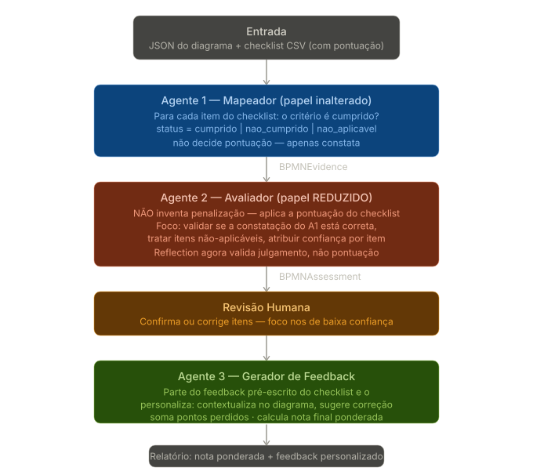

# Papel do agente 2

### O que o checklist real revela

O checklist não é só uma lista de critérios — é um instrumento de pontuação completo. Cada linha já traz quatro coisas prontas:

A **categoria** com seu peso global (sintaxe 30%, modelagem alinhada à proposta 20%, semântica 20%, boas práticas 20%, legibilidade 10%). O **item avaliado** como pergunta. O **feedback pré-escrito** — a frase exata que descreve o erro quando o critério não é cumprido. E a **pontuação** — o valor que se perde se o critério falhar.

Isso elimina uma suposição que estava embutida na arquitetura: a de que o Agente 2 precisaria *decidir* quanto penalizar e *escrever* a justificativa do zero. Ele não precisa de nenhuma das duas coisas. A penalização e o texto-base do feedback já vêm no checklist.

### Como isso muda o papel de cada agente

### O impacto concreto em cada agente

**Agente 1 — praticamente inalterado.** Ele continua fazendo o que fazia: para cada item do checklist, verificar no diagrama se o critério é cumprido ou não. A única mudança útil é o vocabulário de status, que agora se alinha melhor ao formato do checklist — `cumprido`, `nao_cumprido`, `nao_aplicavel`. Esse terceiro valor é importante: muitos critérios só fazem sentido em diagramas com certas características (por exemplo, "o conector fluxo de mensagem está sendo usado apenas entre piscinas" não se aplica a um diagrama de piscina única).

**Agente 2 — o papel encolheu, e isso é bom.** A versão anterior previa que o Agente 2 decidisse o quanto penalizar e escrevesse a justificativa do zero — duas tarefas subjetivas e propensas a erro. Agora a penalização vem pronta do checklist (a coluna Pontuação) e o texto-base do feedback também (a coluna Feedback). O Agente 2 não inventa mais nada disso. O que sobra para ele é mais focado e mais defensável: validar se a constatação do Agente 1 está realmente correta, decidir corretamente os casos de "não aplicável", e atribuir o score de confiança. O loop de Reflection continua existindo, mas agora ele revisa *o julgamento* ("o A1 acertou ao dizer que esse critério não foi cumprido?"), não *a pontuação*.

**Agente 3 — ganhou um ponto de partida e uma tarefa nova.** Antes ele gerava o feedback do zero. Agora ele parte da frase pré-escrita do checklist — por exemplo, *"os eventos de início não foram estabelecidos para cada piscina no agrupamento"* — e a personaliza: contextualiza no diagrama específico do aluno (qual piscina, qual ponto do fluxo), e adiciona a sugestão de correção, que o checklist não traz. A tarefa nova é o **cálculo da nota final**, que ficou bem definido com a pontuação no arquivo.

### Como funciona o cálculo da nota

O checklist tem uma estrutura de pontuação clara. Cada categoria tem um peso (sintaxe 30%, proposta 20%, semântica 20%, boas práticas 20%, legibilidade 10%) e o total é 10. Cada item tem um valor de penalização individual.

A lógica é de desconto: o aluno começa com a nota cheia e perde a pontuação de cada item `nao_cumprido`. Repare que os valores variam bastante — na sintaxe, a maioria dos itens vale 0,2, mas "todas as atividades em raias diferentes" vale 0,3; na proposta, "gateways esperados não modelados" vale 0,8, o item mais pesado do checklist inteiro. Isso significa que o sistema não trata todos os erros igualmente — e isso conecta diretamente ao problema da pesquisa de mestrado sobre hierarquização de critérios.

### Por que essa mudança fortalece o projeto

Há um ganho que vai além de simplificar o código. Ao tirar a decisão de pontuação do LLM e colocá-la no checklist, você torna o sistema **determinístico e auditável** na parte que mais importa para uma avaliação educacional. Dois alunos com o mesmo erro perdem exatamente os mesmos pontos, sempre — porque a penalização vem de uma tabela, não de um julgamento variável do modelo. O LLM é usado onde ele é bom (perceber o diagrama, validar constatações, personalizar texto) e fica de fora de onde ele é arriscado (atribuir notas). Para um artigo acadêmico, esse é um argumento de validade muito forte.

